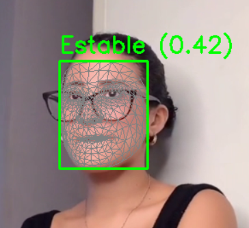
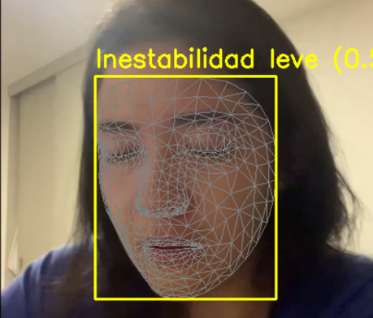
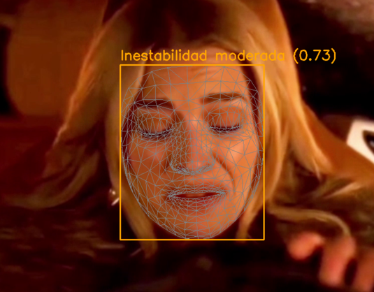
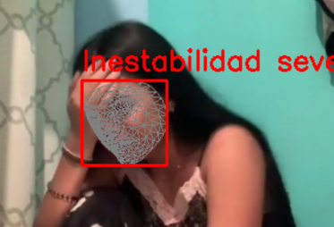
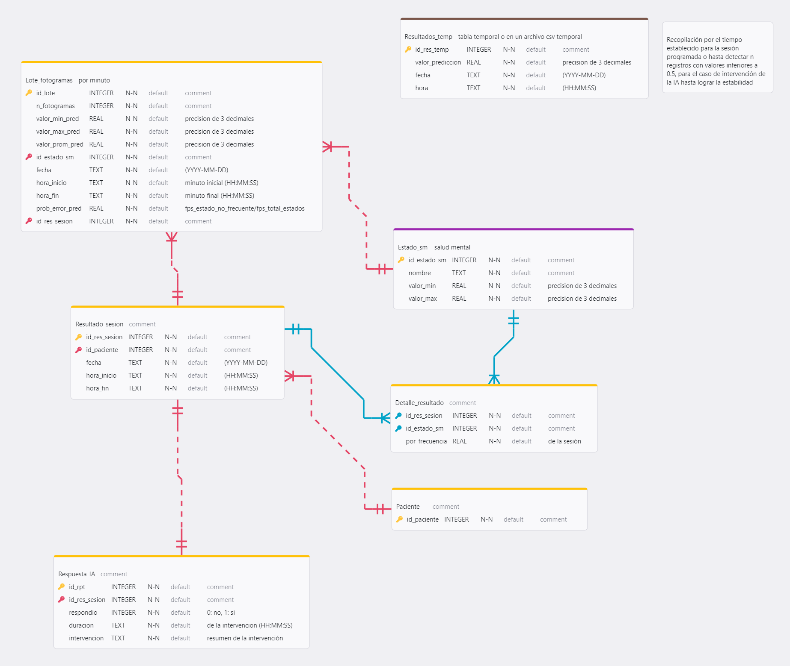
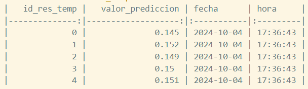
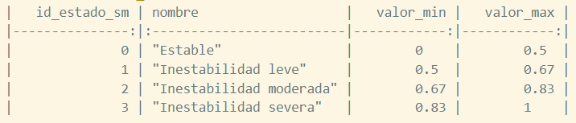
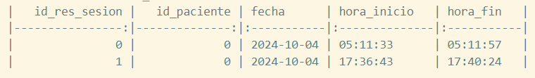
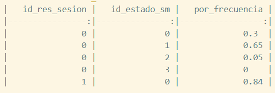
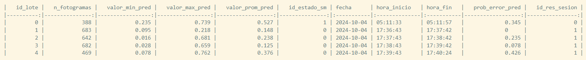

# RECONOCIMIENTO FACIAL
## Entrenamiento de los modelos
### Basado en:
OmesTutorials2020 - 7 RECONOCIMIENTO DE EMOCIONES: 
[Enlace al repositorio base](https://github.com/GabySol/OmesTutorials2020/tree/master)

### Modelos:
1. Eigenfaces
2. Fisherfaces
3. LBPH
4. CNN con Tensorflow Lite
5. CNN con Tensorflow Lite utilizando puntos faciales y Mediapipe

### Pasos para su ejecución:
1. Crea un entorno virtual.
2. Instala las dependencias del archivo `requirements.txt` empleando el comando `pip install -r requirements.txt`.

3. Ejecuta el archivo `captura_emociones.py`.
4. Ejecuta el archivo `entrenamiento.py`.
5. Ejecuta el archivo `reconocimiento.py`.

### Ejemplo de funcionamiento (Modelos 1, 2 y 3):

### Ejemplo de funcionamiento (Modelo 4):

    
    
    
    

### Ejemplo de funcionamiento (Modelo 5):

    
    
    
    

## Jerarquización de estado inestable

    
    
    
    

## Modelo lógico de la BD para almacenar los resultados (SQLite)

## Resultados de procesamiento de la data temporal (sesión de análisis)
*Se muestra 5 registros por tabla*
1. Archivo Resultados_temp.csv

    

2. Archivo Estado_sm.csv

    

3. Archivo Resultado_sesion.csv

    

4. Archivo Detalle_resultado.csv

    

5. Archivo Lote_fotogramas.csv

    